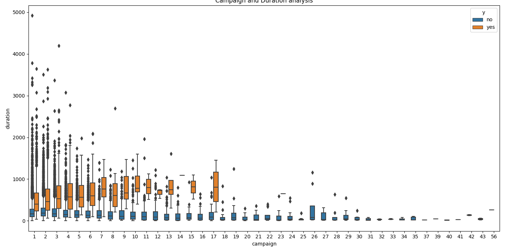
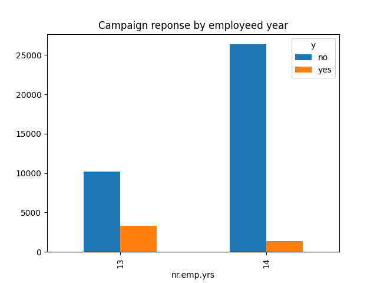
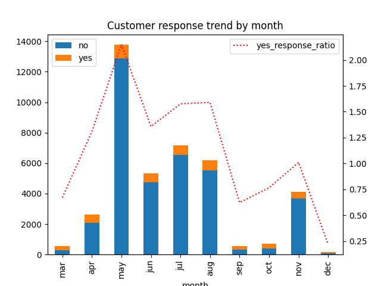
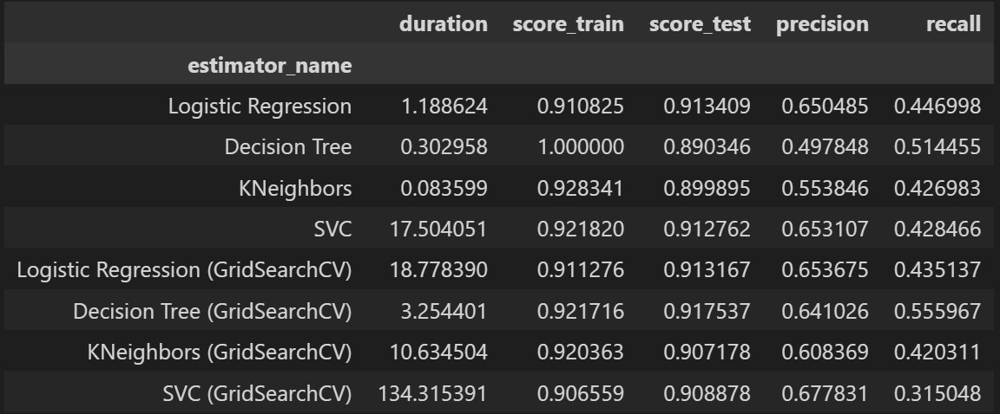

# Compare the performance of the classifiers

The main goal of this experiment is understaning the performance (fitting time and accuracy) of following estimators

- K-nearest neighbors
- Logistic regression
- Decision trees
- Support vector machines

To compare the performance, __the marketing of bank products over the telephone__ data will be used equaly

## Findings

- 90.54% of our customers are between 25 and 58

- Customers who had default wasn't the targeted for the campaings

- Contacting the customer for the same campaing more than 18 times isn't effective

- Employed year around 13 years is relatively response postive to our campaing

- Each month show difference postive reponse ratio

## The Best Model

`Decision Tree (GridSearchCV)` {'estimator__criterion': 'gini', 'estimator__max_depth': 6}

_roc_curve.png)

Decision Tree showed the best score among other estimators

## Recommendation

1. Integrate model with CRM

- Apply the model to predcit the customer reponse
- Help campaign team to use the model easy in the CRM interface

1. Run predict in CRM

- Filter customer who is likely to accept our campagin offer

1. Contact the customer no more than 18 which can help us to reduce marketing budgets

1. Improve model

- Need more infromation about our customer
- Build feedback loop to collect new data

## Next step

1. Meeting with marketing team

- the model will be interated with CRM (Customer Relation Management) system

1. Target customer using the findings from the project

- Target customer
  - Employed 13 years
  - Age 25 to 58
  - No default history